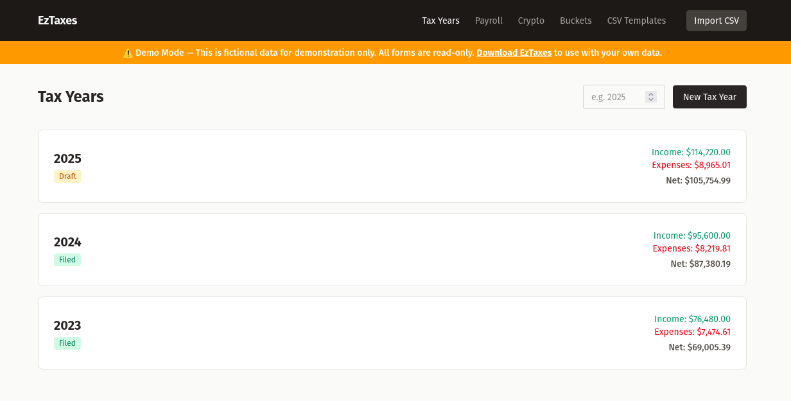
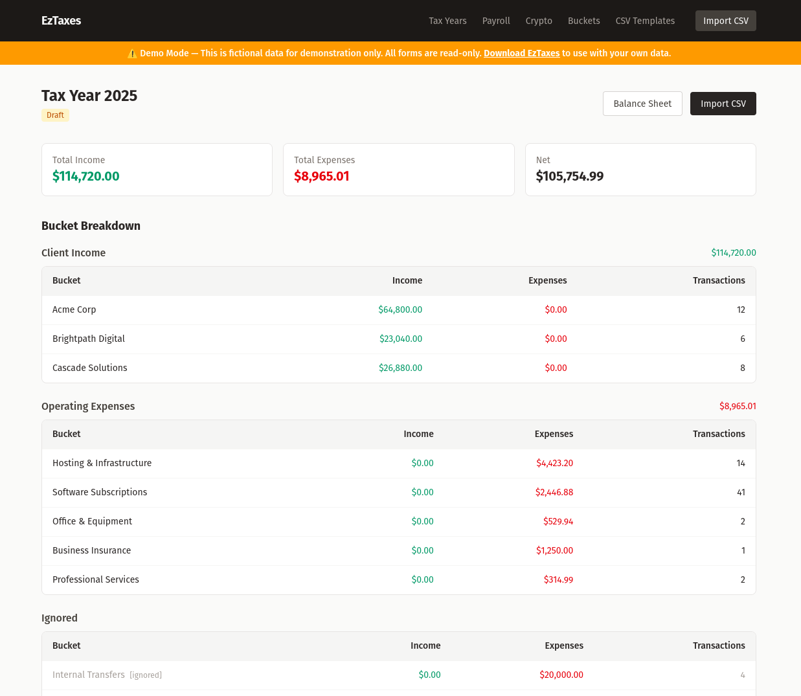
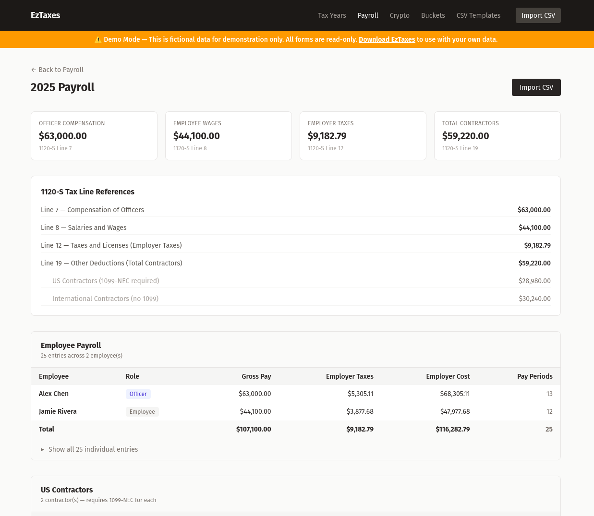
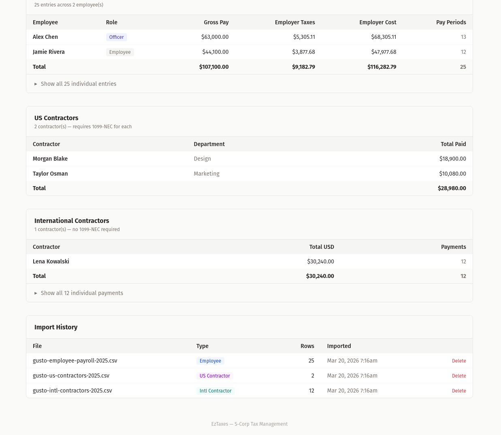
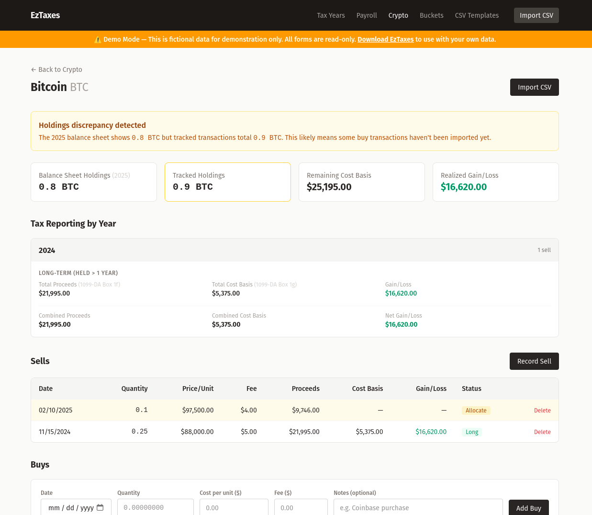
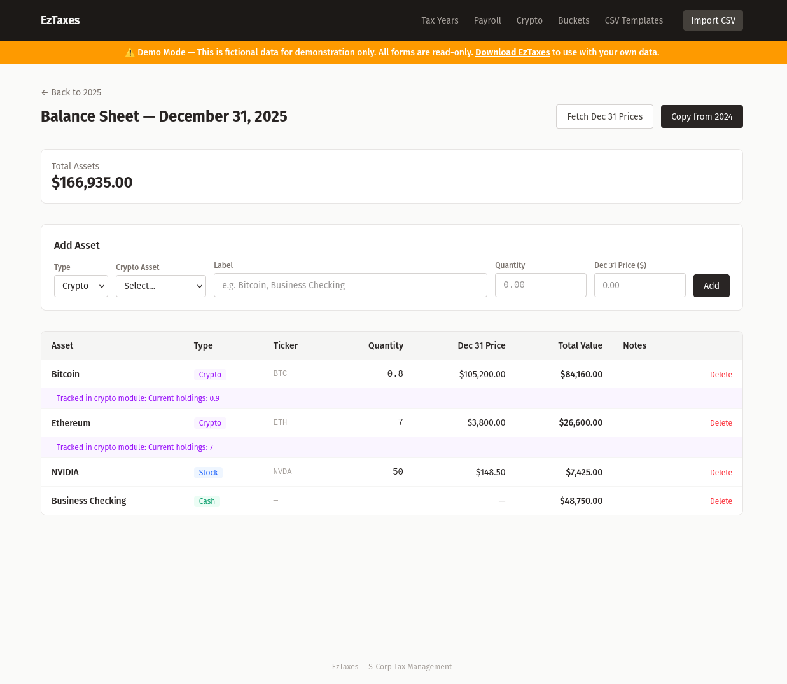

# EzTaxes

S-Corp tax management dashboard with built-in integrations for **Gusto**, **Coinbase**, **CashApp**, and automatic price lookups via **CryptoCompare** and **Alpha Vantage**. Track your corporate crypto treasury and stock assets. Features an auto-detecting CSV upload page with built-in templates for six supported formats from Gusto, Coinbase, and CashApp - PLUS the ability to upload your own banking records and categorize transactions with regex pattern matching.

**[Live Demo](https://eztaxes.wetfish.net)** — try it with fictional data (read-only)

## Screenshots

### Tax Year Dashboard
Track multiple tax years with income, expenses, and net totals at a glance. Filed years are marked green, drafts in yellow.



### Transaction Categorization
Upload bank CSVs and categorize transactions using regex pattern matching. Bucket groups organize categories by type — Client Income, Operating Expenses, and Ignored transactions are tracked separately.



### Payroll with 1120-S Tax Lines
Import Gusto payroll data with automatic officer/employee splitting for IRS form lines. Summary cards map directly to 1120-S Lines 7, 8, 12, and 19.



Track US and international contractors with import history showing which Gusto CSV files have been loaded.



### Crypto Cost Basis Tracking
Full buy/sell tracking with specific identification, long-term vs short-term classification, and IRS form references. Balance sheet cross-referencing flags discrepancies automatically.



### Corporate Balance Sheet
Track crypto, stocks, and cash holdings per tax year. Fetch December 31 prices automatically via CryptoCompare and Alpha Vantage APIs. Crypto holdings cross-reference with the crypto module.



## Integrations

**Gusto Payroll** — Import employee payroll, US contractor payments, and international contractor payments directly from Gusto CSV exports. Auto-detects all three report formats, skips preamble rows and summary totals, and routes data into a dedicated Payroll module with 1120-S tax line references (Lines 7, 8, 12, 19). Mark employees as officers to split compensation between Line 7 (Officer Compensation) and Line 8 (Salaries and Wages).

**Coinbase** — Import gain/loss reports with fully-allocated buy+sell pairs. Cost basis, proceeds, and holding period are pre-calculated. Supports the multi-line preamble format Coinbase uses.

**CashApp** — Import transaction history with automatic separation of buys and sells. Sells are queued for manual cost basis allocation using the specific identification method.

**CryptoCompare API** — Free API (no key required) for fetching December 31 year-end crypto prices on the balance sheet.

**Alpha Vantage API** — Free tier (25 calls/day) for fetching December 31 year-end stock prices on the balance sheet. Includes rate limiting with 15-second delays between calls.

**Bank Statements** — Upload CSV exports from any bank or financial institution. Auto-detects common column names (Date, Amount, Description, Posting Date, Memo, etc.) with a priority-based matching system that prefers exact matches over aliases. Save column mappings as reusable templates for repeat imports.

## Smart CSV Upload

One global import page for everything. Upload any CSV and the system automatically detects the format, identifies the tax year from the data, and routes to the correct module:

- Gusto files → Payroll module (employee wages, contractor payments)
- CashApp / Coinbase files → Crypto module (buys, sells, cost basis) with auto-detected asset symbol
- Bank statements → Transaction module (categorization, pattern matching)

Built-in templates are seeded on setup for all six supported formats. The confirmation page shows what was detected with a green banner (e.g., "Detected: Coinbase Gain/Loss") and lets you review before importing. Crypto imports auto-detect the asset and let you select or create one. Bank imports let you adjust the column mapping and save custom templates.

## Features

### Payroll Management
- Three Gusto CSV formats: Employee Payroll, US Contractor Payments, International Contractor Payments
- Officer/employee designation — toggle per person, splits totals between 1120-S Lines 7 and 8
- Per-employee and per-contractor summaries with expandable detail views
- Tax reconciliation entries (negative employer taxes) handled automatically
- 1120-S tax line references: Line 7 (Officer Compensation), Line 8 (Salaries and Wages), Line 12 (Employer Taxes), Line 17 (Employer Contributions), Line 19 (Total Contractors with US/Intl breakdown)
- Summary rows ("Grand totals", "Total Report", "All contractors") automatically filtered out during import

### Transaction Import & Categorization
- Upload bank CSV files with auto-detected column mapping and priority-based header matching
- Preamble scanning — handles CSVs with metadata rows before the actual headers
- Delimiter auto-detection (comma vs tab)
- Regex pattern matching for automatic transaction categorization
- Multi-bucket tagging — a single transaction can belong to multiple categories
- Bucket groups for organizing buckets into categories (Client Income, Operating Expenses, Payroll, Assets, Ignored)
- Default groups seeded automatically on setup
- Tax year detail page shows income/expense subtotals grouped by bucket group
- Pattern builder UI — test a regex against live data, see match count, then save to a bucket
- Manual quick-assign for individual unmatched transactions
- Reusable CSV column mapping templates for repeat imports

### Cryptocurrency Cost Basis
- Track multiple crypto assets (Bitcoin, Ethereum, etc.)
- Record buys and sells manually or import via the global CSV upload page
- Multi-format CSV import with automatic detection: CashApp (creates separate buys/sells) and Coinbase gain/loss reports (creates fully-allocated buy+sell pairs with cost basis pre-calculated)
- Auto-detects asset symbol from CSV data and pre-selects the matching crypto asset, with option to create new assets inline during import
- Smart header scanning — handles CSVs with disclaimer preambles and metadata rows
- Specific identification method — manually select which buys each sell draws from
- Fees tracked on both buys and sells, factored into cost basis and proceeds
- Auto-calculates gain/loss and long-term vs short-term per allocation
- Tax reporting by year with IRS form field references (1099-DA Box 1f / 1g)
- Unallocated sell queue for retroactive cost basis assignment after bulk CSV import
- Balance sheet cross-referencing — shows balance sheet holdings alongside tracked holdings with discrepancy warnings when transactions are missing

### Corporate Balance Sheet
- Track corporate assets (crypto, stocks, cash, other) per tax year
- Automatic Dec 31 price fetching via CryptoCompare (crypto) and Alpha Vantage (stocks)
- Crypto items link to the crypto module for cross-referencing
- Copy balance sheet from previous year with auto-suggested adjustments based on verified crypto buys and sells
- Inline editing for quantity, price, ticker symbol, and notes
- Three independent views (transaction activity, crypto assets, balance sheet) serve as separate sources of truth — data is never merged or double-counted between them

### Artisan Commands
- `taxyear:create {year}` — create a new tax year
- `csv:import {year} {file}` — import a CSV from the command line
- `buckets:import-legacy` — import buckets and patterns from a serialized PHP file
- `report {year}` — generate per-bucket income/expenses summary
- `taxyear:recalculate {year?}` — recalculate cached totals

## Tech Stack

- **Framework:** Laravel 12.12.1 (released March 10, 2026; Laravel 12 initially released February 24, 2025)
- **PHP:** 8.5 (Laravel 12 requires 8.2+; PHP 8.5 compatibility added in Laravel 12.8+)
- **Composer:** 2.9.5+ (older versions are incompatible with PHP 8.5)
- **Database:** MySQL 8.0 (development/production) or SQLite (demo)
- **Frontend:** Blade templates (no starter kit), Tailwind CSS via Vite
- **Environment:** Docker (development) or bare metal with Nginx + PHP-FPM (production)

## Quick Start (Docker — Development)

Start the Docker environment:

```bash
docker compose up -d
```

Run migrations and seed default data:

```bash
docker compose exec app php artisan migrate --seed
```

Build frontend assets (run from host machine):

```bash
cd laravel && npm install && npm run build && cd ..
```

Access the app at `http://localhost:8010`.

## Demo Deployment (Bare Metal — Production)

A one-command setup script is included for deploying a read-only demo instance on a fresh Ubuntu server:

```bash
chmod +x docs/setup-demo.sh
sudo docs/setup-demo.sh
```

The script handles everything: creates a dedicated service user, installs PHP 8.5 + Nginx, clones the repo, builds the frontend, configures SQLite with demo seed data, and sets up the site with firewall rules. After running, just point your DNS and install an SSL certificate:

```bash
sudo apt install certbot python3-certbot-nginx -y
sudo certbot --nginx -d your-domain.com
```

Demo mode enables a read-only middleware that blocks all write operations, displays a warning banner on every page, and uses fictional seed data. Set `DEMO_MODE=true` in `.env` to enable.

## Setup

### Environment configuration

Update `laravel/.env` to match the Docker container names:

```ini
DB_CONNECTION=mysql
DB_HOST=eztaxes-db
DB_PORT=3306
DB_DATABASE=eztaxes
DB_USERNAME=eztaxes
DB_PASSWORD=secret
SESSION_DRIVER=file
ALPHAVANTAGE_API_KEY=your_key_here
```

From the host machine, the database is accessible on port `3446` (mapped to avoid conflicts with other projects).

### Seeded Data

The `--seed` flag runs the DatabaseSeeder which creates:
- Default bucket groups (Client Income, Operating Expenses, Payroll, Assets, Ignored)
- Built-in CSV templates for Gusto Employee Payroll, Gusto US Contractors, Gusto International Contractors, CashApp Crypto, and Coinbase Gain/Loss

The seeders are idempotent and safe to re-run.

### PHP dependencies

Laravel 12 requires the following PHP extensions: Ctype, cURL, DOM, Fileinfo, Filter, Hash, Mbstring, OpenSSL, PCRE, PDO, Session, Tokenizer, and XML. Several of these are bundled with `php8.5-common`.

Install all required dependencies on Ubuntu/Debian:

```bash
sudo apt install php8.5-cli php8.5-common php8.5-curl php8.5-mbstring php8.5-xml php8.5-bcmath php8.5-zip php8.5-mysql php8.5-fpm unzip -y
```

### Composer

Composer 2.9.5+ is required. Older versions have a known incompatibility with PHP 8.5 (`stream_context_create()` error in `RemoteFilesystem`). Upgrade with:

```bash
composer self-update
```

### Tailwind CSS

Tailwind is compiled via Vite. No dev server needed — just build on the host:

```bash
cd laravel && npm run build && cd ..
```

Re-run `npm run build` after modifying CSS or Blade templates.

## Docker Environment

| Container | Image | Purpose | Ports |
|-----------|-------|---------|-------|
| eztaxes-app | php:8.5-fpm (custom) | PHP-FPM with Laravel extensions, Composer, Redis | 9000 (internal) |
| eztaxes-nginx | nginx:alpine | Serves `laravel/public/`, proxies PHP to app | 8010 → 80 |
| eztaxes-db | mysql:8.0 | MySQL database | 3446 → 3306 |

| Config File | Purpose |
|-------------|---------|
| `docker/nginx/default.conf` | Nginx server block pointing to `laravel/public` |
| `docker/php/custom.ini` | PHP overrides (memory_limit = 512M) |

## Documentation

Detailed technical documentation lives in the [`docs/`](docs/) directory:

- [Database Schema](docs/01-database-schema.md) — table definitions, model relationships, cascade behavior
- [Services & Commands](docs/02-services-and-commands.md) — service classes, artisan commands, matching pipeline, crypto calculations
- [Routes & Controllers](docs/03-routes-and-controllers.md) — full route listing, controller responsibilities, request flows
- [Frontend](docs/04-frontend.md) — Tailwind/Vite setup, Blade templates, view structure, UI conventions
- [AI Development Notes](docs/05-ai-development-notes.md) — conventions for AI-assisted development with Claude
- [Planned Features](docs/06-planned-features.md) — future feature roadmap
- [Demo Setup Script](docs/setup-demo.sh) — one-command deployment for a public demo instance

## Disclaimer

⚠️ EzTaxes is a personal financial tracking tool, not tax preparation software. Use it at your own risk. Always consult a qualified tax professional or financial advisor before filing your taxes. AI tools are great for double-checking your work, but they are not a substitute for professional advice.